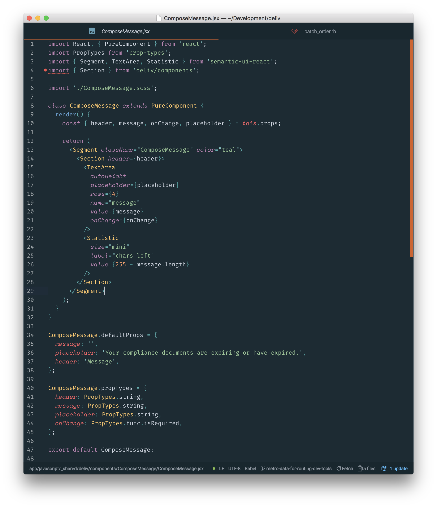
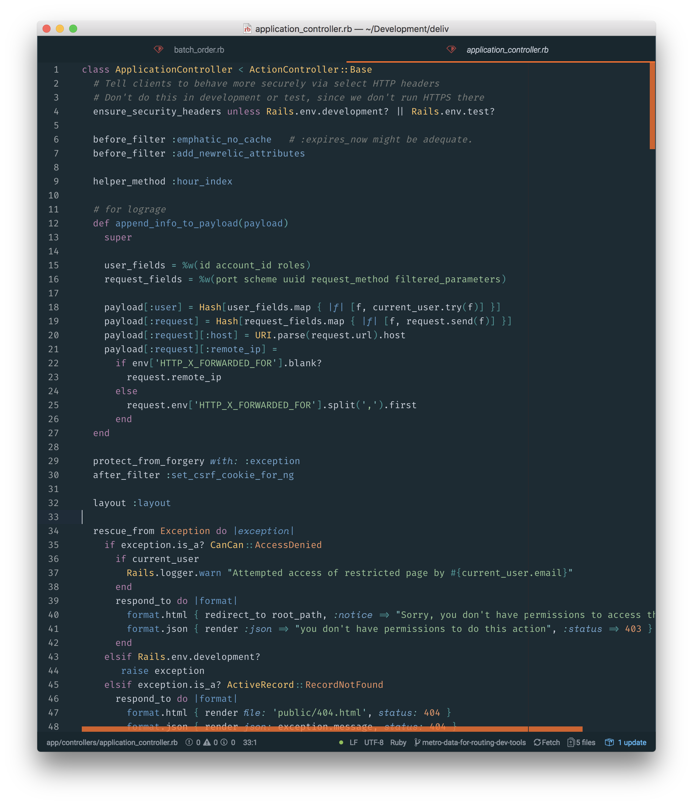

# Install fonts

Download and install the latest version of:  
Fira code - https://github.com/tonsky/FiraCode  
Space Mono - https://fonts.google.com/specimen/Space+Mono

# Install Atom packages

```terminal
apm install language-babel
apm install atom-material-ui
apm install operator-mono
```

## Atom Material settings

Primary color: `#FF6B1D`  
Secondary color: `#36BAFF`  
Constrasting panels: `true`  
Tree View Compact List: `true`

## Atom Stylesheet

Open Atom -> Stylesheet (styles.less) and copy this code:

```less
atom-text-editor {
  .gutter {
    color: #fff;
    background-color: #1b2b34;
  }
}

.pane {
  border-left: 1px #253b48 solid;
  border-right: 1px #253b48 solid;
}

atom-text-editor.editor {
  /*
    Transform selected text into alternative font for elegant touch:
    - this
    - HTML and JSX attributes
    - JS functions (except arrow function)
    - JS undefined
    - JS storage (const/let/async)
    - EX constants
    - Ruby (nil/self/block)
    - Ruby hash keys
  */
  .syntax--variable.syntax--language.syntax--this,
  .syntax--html > .syntax--attribute-name,
  .syntax--JSXAttrs > .syntax--attribute-name,
  .syntax--storage.syntax--type.syntax--js:not(.syntax--function):not(.syntax--arrow),
  .syntax--constant.syntax--language.syntax--undefined.syntax--js,
  .syntax--constant.syntax--other.syntax--object.syntax--key.syntax--js,
  .syntax--variable.syntax--other.syntax--constant.syntax--elixir,
  .syntax--constant.syntax--language.syntax--elixir,
  .syntax--constant.syntax--language.syntax--nil.syntax--ruby,
  .syntax--variable.syntax--language.syntax--self.syntax--ruby,
  .syntax--constant.syntax--other.syntax--symbol.syntax--hashkey.syntax--ruby,
  .syntax--variable.syntax--other.syntax--block.syntax--ruby {
    vertical-align: baseline;
    font-family: 'Space Mono';
    font-size: 100%;
    font-style: italic !important;
    height: inherit;
    line-height: 100%;
  }
}
```



